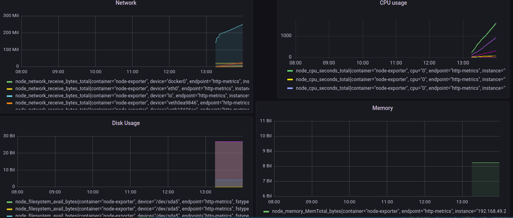

# Grafana
## Common Grafana features:

- Visualize: Grafana has a plethora of visualization options to help you understand your data from - graphs to histograms, you have it all.
- Alerts: Grafana lets you define thresholds visually, and get notified via Slack, PagerDuty, and more
- Unify: You can bring your data together to get better context. Grafana supports dozens of databases, natively.
- Open-Source: It’s completely open source. You can use Grafana Cloud, or easily install on any platform.
- Explore Logs: Using label filters you can quickly filter and search through the laundry list of logs.
- Display dashboards: Visualize data with templated or custom reports.Create and Share reports:
- Create and Share reports: Create and share reports to your customers and stakeholders. This feature is not available in the open-source version. You can upgrade to avail it. 

## Create a dashboard
To create your first dashboard:

- Click the + icon on the side menu.
- On the dashboard, click Add an empty panel.
- In the New dashboard/Edit panel view, go to the Query tab.
- Configure your query by selecting -- Prometheus -- from the data source selector. This generates the Random Walk dashboard.
- on Metrics browser field search for node_cpu_seconds_total (For monitoring CPU usages of node)
- Click the Save icon in the top right corner of your screen to save the dashboard.
- Add a descriptive name, and then click Save.
  
  See your dashboard as
  

  ## Grafana alerts
  Alerts allow you to learn about problems in your systems moments after they occur. Robust and actionable alerts help you identify and resolve issues quickly, minimizing disruption to your services.
Grafana alerting has four key components:

- Alerting rule - Evaluation criteria that determine whether an alert will fire. It consists of one or more queries and expressions, a condition, the frequency of evaluation, and optionally, the duration over which the condition is met.
- Contact point - Channel for sending notifications when the conditions of an alerting rule are met.
- Notification policy - Set of matching and grouping criteria used to determine where and how frequently to send notifications.
- Silences - Date and matching criteria used to silence notifications.

# For installing Grafan only(Bydefault Grafana will be installed in prometheus)

## Install Grafana on local ubuntu machine
```
wget -q -0 https://packages.grafana.com/gpg.key | sudo apt-key add-
sudo add-apt-repository "deb https://packages.grafana.com/oss/deb stable main"
sudo apt update
sudo apt install grafana
sudo systemctl start grafana-server
sudo systemctl status grafana-server
sudo systemctl enable grafana-server
```
## Install Grafana via Docker
```
docker run -d --name=grafana -p 3000:3000 grafana/grafana