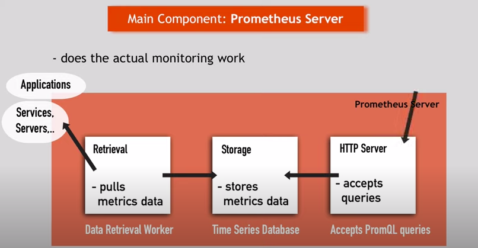
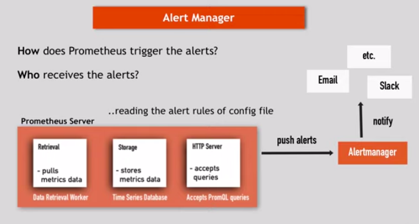
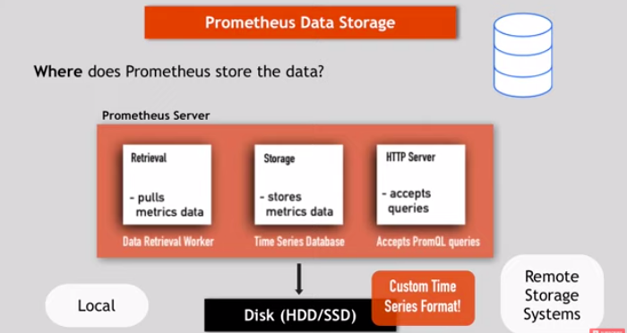
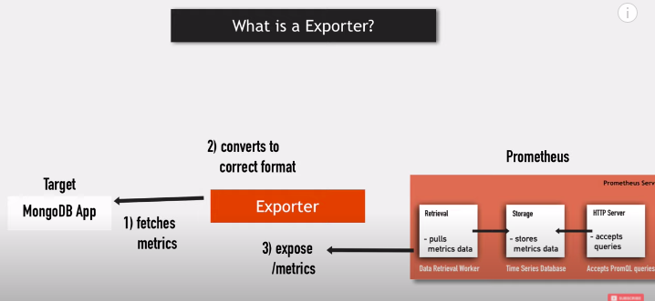
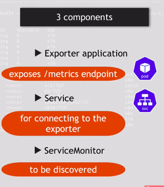

# Prometheus
Prometheus is an open-source systems monitoring and alerting toolkit .   
Prometheus collects and stores its metrics as time series data, i.e. metrics information is stored with the timestamp at which it was recorded, alongside optional key-value pairs called labels.   
Prometheus is designed for reliability, to be the system you go to during an outage to allow you to quickly diagnose problems. Each Prometheus server is standalone, not depending on network storage or other remote services.

## Installing as a Docker Container
```
docker run -p 9090:9090 --name prometheus prom/prometheus
```
## Prometheus Monitoring
- Constantly monitoring the services
- alert when crash
- identiry problem before
- Constantly checking memory, disk space : Alerts to system admin
- Monitoring network load

## Prometheus Component

## Target and metrics

## Alert Manager

## Prometheus Data Storage

## Querying Prometheus


## Prometheus Characteristics
- Reliable
- Stand-alone and self-containing
- works, even if other parts of infrastrue broken
- no extensive set-up needed
- less complex

# Setting up Prometheus using Helm
```
$ helm repo add prometheus-community https://prometheus-community.github.io/helm-charts   
$ helm install [RELEASE_NAME] prometheus-community/kube-prometheus-stack
```
## Exporter
Best practise separate deployment independent of app.


## Exporter Components


### Deploy MongoDB application with deployment and service and then install mongodb exporter using helm
```
helm install [RELEASE_NAME] prometheus-community/prometheus-mongodb-exporter 
```
Upgrade the helm Chart with following yaml
```
helm upgrade [RELEASE_NAME] prometheus-community/prometheus-mongodb-exporter
```
# values.yaml
```
mongodb:
  uri: "mongodb://mongodb-service:27017"   #mongodb uri

serviceMonitor:
  namespace:
  additionalLabels: 
    release: my-prometheus   # prometheus release_name
```